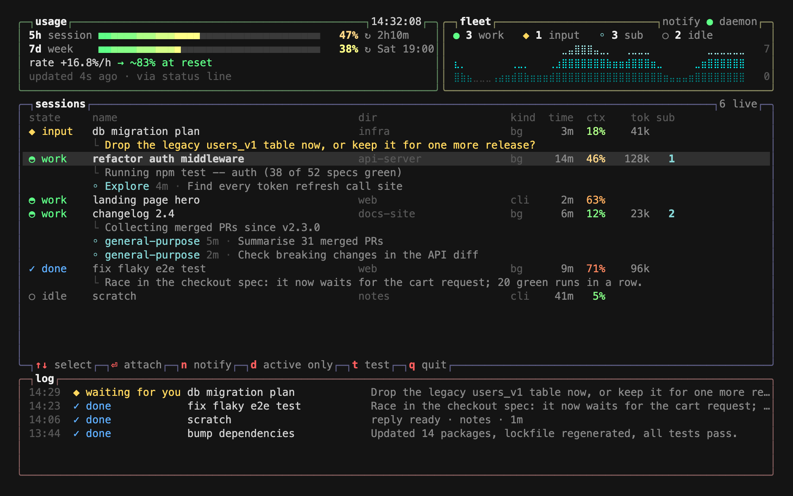

# cctop

btop for Claude Code. One terminal view of everything Claude is doing right now, how much of your
usage limit is left, and a desktop notification the moment a session finishes or needs you.



- **usage**: your 5-hour session limit and weekly limit in %, time to reset, burn rate in %/h and
  where you will land at reset (red when you would hit the limit before it resets).
- **fleet**: how many sessions are working, waiting for you or idle, how many subagents run, and
  a graph of the last minutes.
- **sessions**: every live session (background jobs and interactive ones) with state, folder,
  time in the current state, context fill, tokens and running subagents, plus what each one is
  doing right now or what it finished with.
- **log**: the latest notifications.

## Requirements

- macOS (the notification daemon uses launchd; on Linux the view and status line work, and an
  open cctop window notifies through `notify-send`)
- [Claude Code](https://docs.claude.com/en/docs/claude-code) on a Pro or Max plan: Claude Code
  only reports the usage limits for subscriptions. With an API key the usage box stays empty,
  everything else works.
- Node.js 23.6 or newer (runs the TypeScript sources directly, there is no build step)
- `jq`
- optional: `terminal-notifier`, so clicking a notification brings your terminal to the front

```sh
brew install node jq terminal-notifier
```

## Install

```sh
git clone https://github.com/Constantin404/cctop.git ~/cctop
~/cctop/bin/cctop install
cctop test-notify                             # macOS asks once whether to allow notifications: allow
cctop
```

Any clone location works. `cctop install` prints one line per step and tells you if something
is missing (for example `jq`, or `~/.local/bin` not being on your `PATH`).

Running Claude Code sessions pick up the change on their own; the usage numbers appear after the
next reply of any session.

Only want the view, without the background notifier? `~/cctop/bin/cctop install --no-daemon`.
An open cctop window still sends notifications then.

## Use

```
cctop                    live view (q quits)
cctop status [--json]    one-off snapshot, --json for scripts
cctop test-notify        sends a test notification
```

| key | action |
| --- | --- |
| `↑` `↓` / `j` `k` | select a session |
| `⏎` | open the selected background job in a new window (`claude attach`); in terminals without a scripting API the command is copied to the clipboard |
| `n` | notifications on / off |
| `d` | show only active sessions |
| `t` | send a test notification |
| `q` | quit |

You get a notification when a background job is done, waits for your input or fails, and when an
interactive session finishes a turn that took at least 20 seconds.

## Update

```sh
cd ~/cctop && git pull && ./bin/cctop install
```

Run `cctop install` again after every update (it refreshes the runtime copy the daemon runs
from) and after switching Node versions, for example with nvm (the daemon remembers the Node
path).

## Uninstall

```sh
cctop uninstall
```

This stops the daemon, puts your previous status line back, and removes the symlink and the
runtime copy. Your data stays in `~/.claude/cctop` until you delete it.

## What install changes on your machine

- `~/.claude/settings.json`: `statusLine` now points to cctop's tap, which calls your previous
  status line command unchanged and appends a small usage badge (`5h 47% 7d 38%`). The previous
  command is saved in `~/.claude/cctop/statusline-next`, and the whole file is backed up to
  `~/.claude/settings.json.bak-cctop`.
- `~/Library/LaunchAgents/cctop.notifier.plist`: the notifier daemon.
- `~/.local/bin/cctop`: symlink to `bin/cctop` in your clone.
- `~/.local/share/cctop`: a copy of the sources that the daemon and the tap run from, because
  macOS does not let launchd agents read `~/Desktop` or `~/Documents`.
- `~/.claude/cctop/`: config, cached usage readings, notification log.

## Settings

`~/.claude/cctop/config.json`, created by `cctop install`:

| key | default | |
| --- | --- | --- |
| `notify` | `true` | notifications on or off (also the `n` key) |
| `minWorkSec` | `20` | interactive sessions only notify after a turn of at least this long |
| `soundDone` / `soundInput` | `Glass` / `Funk` | any name from `/System/Library/Sounds` |
| `hideDone` | `false` | show only active sessions (also the `d` key) |
| `lang` | system locale | `en` or `de` |
| `terminal` | detected at install | bundle id that a notification click brings forward, e.g. `com.googlecode.iterm2` |

## How it works

- Sessions come from the files Claude Code keeps for its own agent view
  (`~/.claude/sessions/*.json`, `~/.claude/jobs/*/state.json`), the same data as
  `claude agents --json`. Subagents come from `~/.claude/projects/*/<session>/subagents/`.
  cctop only reads these files.
- Usage: Claude Code hands the limit percentages to the status line command and nowhere else.
  The model never sees them, which is why Claude says it cannot check your usage while Claude
  Code still warns you at 90%: the warning comes from the program, not from the model. cctop's
  status line tap caches the numbers per session, and cctop uses the highest reading of the
  newest window, since each session only knows the state of its own last reply.

## Troubleshooting

- **Usage stays empty.** Check that `jq` is installed, that you are on a Pro or Max plan, and
  that some session has replied since the install. `ls ~/.claude/cctop/sl` should list files.
- **No notifications.** Run `cctop test-notify`. If nothing shows up, allow `terminal-notifier`
  (or Script Editor) in System Settings → Notifications. Check the daemon with
  `launchctl print gui/$(id -u)/cctop.notifier`; its log is `~/.claude/cctop/daemon.log`.
- **`cctop: command not found`.** Add `~/.local/bin` to your `PATH`, or call
  `~/cctop/bin/cctop` directly.

## Development

```sh
npm install        # TypeScript and Node types, only needed for the typecheck
npm run typecheck
```

The sources in `src/` run as they are. After changing them, run `./bin/cctop install` so the
daemon picks them up.

## License

MIT, see [LICENSE](LICENSE).
